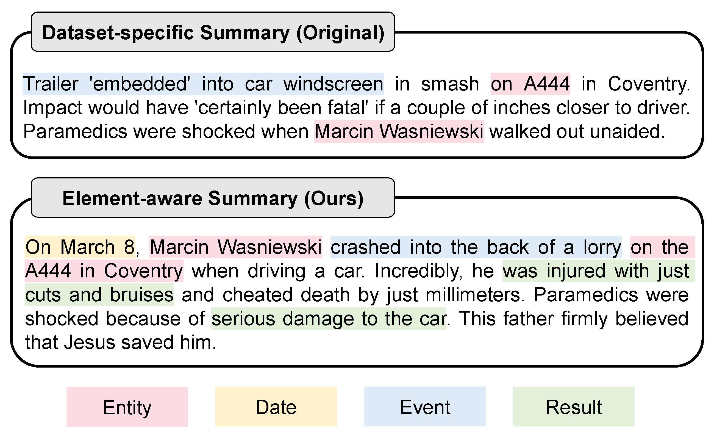
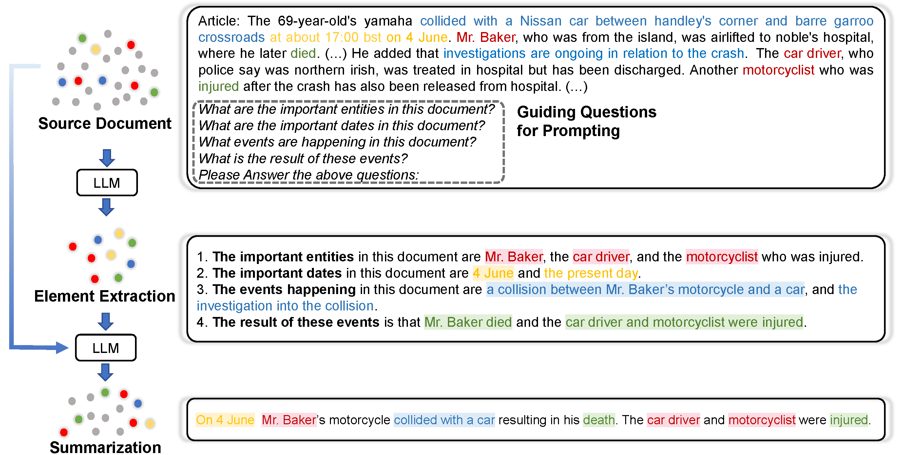

## Element-aware Summarization with Large Language Models: Expert-aligned Evaluation and Chain-of-Thought Method  (ACL'23 Long Paper)


```Let's elicit LLMs summarize step by step following professional communication theory!```

In this work, you can use directly or get inspired by:

- A fine-grained generic summary data annotation protocol (combining micro and macro demands)

- An expert-aligned generic summary test set (rewrite [*CNN/DailyMail*](https://paperswithcode.com/dataset/cnn-daily-mail-1) and [*BBC XSum*](https://paperswithcode.com/dataset/xsum))

- An expandable CoT-based open-end generation path (not only *SumCoT*)


<!-- 

 -->


---


## Element-aware Dataset

### Annotation Statement

Our annotation protocol is mainly based on [*Lasswell Communication Model*](https://en.wikipedia.org/wiki/Lasswell%27s_model_of_communication) --- a famous communication theory proposed by Lasswell(1948). Additionally, we removed as much noise as possible from the original data set and performed data analysis (See paper for more details). 

Case comparisons for our Element-aware summary and original dataset-specific summary:


### Data Usage

- See our constructed datasets in ```/Data```. The two ```json``` files hold the data of *CNN/DailyMail* and *BBC/XSum*, respectively.

- Each ```json``` file contains 200 samples, each containing the **source document**, **original summary**, **element-aware summary**, **GPT-3 summary (standard)**, and **GPT-3 summary (under SumCoT)**. You can use these data for more fine-grained evaluation.

Dataset format:

```json
{
  "dataset_name": [
        {
        "id": 0,
        "src": "xxx",
        "original_summary": "xxx",
        "element-aware_summary": "xxx",
        "gpt3_summary": "xxx",
        "gpt3_cot_summary": "xxx"
        },
        {
        "id": 1,
        "src": "xxx",
        "original_summary": "xxx",
        "element-aware_summary": "xxx",
        "gpt3_summary": "xxx",
        "gpt3_cot_summary": "xxx"
        },
        ...
        {
        "id": 199,
        "src": "xxx",
        "original_summary": "xxx",
        "element-aware_summary": "xxx",
        "gpt3_summary": "xxx",
        "gpt3_cot_summary": "xxx"
        }
    ]
}
```

Data will be released soon...

## Summary Chain-of-Thought (SumCoT)


## Citation

    @article{wang2023element,
    title={Element-aware Summarization with Large Language Models: Expert-aligned Evaluation and Chain-of-Thought Method},
    author={Wang, Yiming and Zhang, Zhuosheng and Wang, Rui},
    journal={arXiv preprint arXiv:2305.13412},
    year={2023}
    }